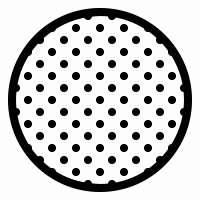

##### **Visit my weird websites**:

##### Follow me on:

[Neocities.org](neocities.org/fftcc)
[Mastodon.social](mastodon.social/fftcc)

##### Buy an avid coffee lover a cup of coffee !

**Click !**

 [QIWI](qiwi.com/n/RUSSI698)   |    [QIWI Donate](https://donate.qiwi.com/payin/copywtf)
[LiberaPay](https://liberapay.com/fftcc/) **! ! ! TEMPORARILY NOT WORKING**
[Ko-Fi](ko-fi.com/fftcc) **! ! ! TEMPORARILY NOT WORKING**

---

 [fftcc-palette](https://www.npmjs.com/package/fftcc-palette)   

[Notabug Repo](https://notabug.org/fftcc/fftcc-palette) [Github Repo Mirror](https://github.com/fftcc/fftcc-palette)

---

 [normalize-mod.css](https://www.npmjs.com/package/normalize-mod.css)   

[Notabug Repo](https://notabug.org/fftcc/normalize-mod.css) [Github Repo Mirror](https://github.com/fftcc/normalize-mod.css)

---

 [own-scrolls](https://www.npmjs.com/package/own-scrolls)   

[Notabug Repo](https://notabug.org/fftcc/own-scrolls) [Github Repo Mirror](https://github.com/fftcc/own-scrolls)

---

 [react-own-scrolls](https://www.npmjs.com/package/react-own-scrolls)   

[Notabug Repo](https://notabug.org/fftcc/react-own-scrolls) [Github Repo Mirror](https://github.com/fftcc/react-own-scrolls)

---

##### **Linux Admin Notes**:

[Notabug Repo](https://notabug.org/fftcc/journal-admin)
[Github Repo Mirror](https://github.com/fftcc/journal-admin)

---

**EMAIL/XMPP** (only OMEMO) <fftcc@disroot.org> | **GPG** [CD2C 0865 16B0 7B70 4034  2426 C946 BC93 0992 BBCB](example)

Made with  fftcc.
